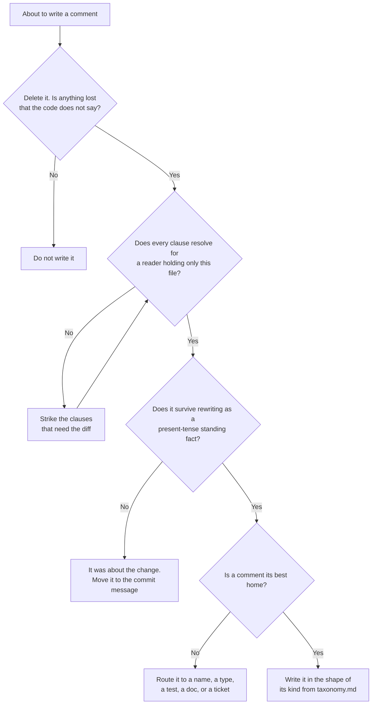

# The Comment Write Gate

This is the half of the skill that runs at write time rather than review time. It costs a few seconds per comment and it is the only moment at which the smell is free to fix. Run it whenever you are about to add or edit a comment, in any language, on any task, whether or not anyone asked for a comment review.

The gate exists because the failure it catches is structural rather than careless. An agent writing code holds a diff in working context, so its natural audience is the reviewer of that diff. The comment's actual audience is a stranger holding only the file, months later. See [agent-context-collapse.md](./concepts/agent-context-collapse.md) for why this happens reliably enough to need a gate.

## The four questions

Ask them in order. The first one that fails ends the comment.

1. **Delete test.** Delete the comment and read the code. Is anything lost that the code does not already say? If nothing is lost, do not write it. This kills Pillar 2 entirely.
2. **Stranger test.** Hand the file to someone who has never seen the diff, the ticket, or the conversation. Does every clause still resolve? Strike each one that does not. This kills ghost references, prompt echo, and session residue.
3. **Tense test.** Rewrite the whole thing as a standing fact in the present tense with no narrator and no history. If the sentence dies under that rewrite, it was about the change, not about the code. Send it to the commit message.
4. **Home test.** Is a comment actually the best place for this? A name, a type, an assertion, a test, a doc comment, a ticket, or an architecture decision record may hold it better and, unlike a comment, may hold it enforceably. The full routing is in [taxonomy.md](./taxonomy.md).

What survives all four is a real comment. Pick its kind from the [nine in the taxonomy](./taxonomy.md) and write it in that kind's shape.



## Trigger phrases

Mechanical pre-filter. These phrases are not banned, but each one is a prompt to run question 2 or 3 on the clause containing it. Most of the time the clause dies.

| Phrase | What it usually means | What to do |
| --- | --- | --- |
| `now`, `we now`, `this now` | the reader is being told about the delta | Drop the word and state the behavior. Keep only if `now` is about runtime, not about the edit |
| `no longer`, `used to`, `previously`, `formerly` | describing code the reader cannot see | Delete the clause, or state the current rule positively |
| `instead of X`, `rather than X` | good if X is the alternative a reader expects, a smell if X is the old code | Apply the comparative test below |
| `the old ...`, `the original ...` | naming something not in the tree | Delete, or name the alternative generically |
| `changed to`, `switched to`, `moved to`, `renamed` | a commit message subject | Move it to the commit |
| `added`, `new`, `this adds` about the code itself | a diff marker | Delete. Nothing in the file is new to its reader |
| `fixed`, `this fixes` | a commit subject | Commit message, plus a provenance comment if the hazard is subtle |
| `as requested`, `per the requirement`, `as discussed` | the prompt echoed back | Delete, or cite a spec the reader can open |
| `let's`, `we`, `I`, `you should` | a narrator between reader and code | Rewrite impersonally about the code |
| `for now`, `currently`, `temporarily` | undated debt nothing will ever list | Promote to a marked TODO with an owner and a trigger condition |
| `should`, `might`, `probably`, `I think` | unresolved uncertainty | Resolve it, or state precisely what is unknown |
| `note that`, `keep in mind`, `it's important to` | filler ahead of the real sentence | Delete the preamble, keep the sentence |
| `safe`, `guaranteed`, `fully handles`, `all cases` | a claim nothing backs | Bound it and back it, or drop it |

**The comparative test**, in full, because it is the one place this gate must not over-fire. "X rather than Y" is good writing when Y is the alternative a reader would reach for on their own. It is change narration when Y is only what the file used to say. Ask whether a reader who never saw the previous version would recognize Y. "Average rather than sum, so a three-word query stays comparable to a one-word one" passes and should be left alone. "Follows the panel width instead of the fixed breakpoint we had" fails.

## Self-check on your own diff

After finishing an edit and before handing it over, look at only the comment lines you added. This is a small enough set to gate one by one.

```sh
# Added comment lines in the working tree, across the common syntaxes.
git diff -U0 | grep -E '^\+' | grep -E '^\+[[:space:]]*(//|#|/\*|\*|///|--|;|<!--|"""|~~)'

# Same, for a whole branch against main.
git diff main...HEAD -U0 | grep -E '^\+' | grep -E '^\+[[:space:]]*(//|#|/\*|\*|///|--|;|<!--|"""|~~)'

# Just the trigger phrases, when the diff is large.
git diff -U0 | grep -E '^\+' | grep -inE '\b(now|no longer|used to|previously|instead of|rather than|the old|changed to|switched to|renamed|as requested|for now|currently|we |let.s)\b'
```

The third command over-matches on purpose. It is a filter for attention, not a verdict; run the four questions on each hit rather than deleting on sight.

Two things this cannot see, so say so rather than implying otherwise. It misses comment lines you did not touch, which is the [decay](./concepts/comment-decay.md) surface, and it misses Pillar 3 findings entirely, since missing comments do not appear in a grep.

## Rewrite recipes

Six real before-and-after pairs, drawn from agent-written comments in a production codebase. The pattern in every one is the same: the reason survives, the history goes to git.

### Keep the reason, cut the ghost

```
- // Group order. With a query the two competing groups are ordered by their own
- // best match, so typing "agent" leads with the Agent Panel concept rather
- // than with whichever action happened to be declared first, and the old fixed
- // Actions-then-Concepts order buried the thing most queries are looking for.
+ // Group order. With a query the two competing groups are ordered by their own
+ // best match, so typing "agent" leads with the Agent Panel concept rather than
+ // with whichever action happens to be declared first. Ordering the groups
+ // statically buries the best match under whichever list comes first.
```

The rejected alternative stays, because a reader would reach for it. What goes is "the old fixed", which turns a durable design note into an unverifiable claim about a file nobody has.

### Turn the justification into the rule

```
- {/* "No matches" on its own was a dead end: it neither said what
-     had been searched nor left anywhere to go. */}
+ {/* The empty state names the query and offers the next move. A bare
+     "no matches" leaves the user with nothing to act on. */}
```

Before, it argues for the change. After, it states why the component is shaped this way, which is still true in five years.

### Present-tense the platform fact

```
- /// On Linux the fixture must not live under /tmp: the restricted profile
- /// mounts a private tmpfs there and now refuses shadowed grants outright.
+ /// On Linux the fixture must not live under /tmp. The restricted profile
+ /// mounts a private tmpfs there and refuses shadowed grants, so a fixture
+ /// under /tmp is invisible to the sandboxed process.
```

Deleting one word ("now") and adding the consequence converts a change note into a trap comment.

### Keep the test's reason, drop the test's history

```
- // Driven by a query rather than the zero state. This guards the bug where
- // `items` and `filteredItems` disagreed on whether the list was grouped, so
- // keyboard navigation only toggled between the first two results. The zero
- // state used to stand in for "a long list" by listing every command; it now
- // deliberately shows a short suggested set, so it no longer can.
+ // Driven by a query rather than the zero state. The bug this guards is about
+ // traversing GROUPS (`items` and `filteredItems` disagreeing on whether the
+ // list is grouped), and only a query produces several groups. The zero state
+ // shows a short suggested set, so it cannot reproduce it.
```

The first two sentences are provenance and they earn their place. The last is a changelog entry, and the fix is to state the current property of the zero state that makes it unsuitable.

### Anchor the measurement, not the migration

```
- // The point of generating in OKLab rather than HSL. The old HSL palette
- // spread these ratios across 4.3 to 11.8 in dark, so a yellow type shouted
- // and a blue one disappeared.
+ // The point of generating in OKLab. Holding perceptual lightness fixed keeps
+ // every type's contrast within a narrow band; a hue-based space spreads it
+ // wide enough that a yellow type shouts and a blue one disappears.
```

"HSL" survives as the naive alternative. "The old HSL palette" does not, because there is no old palette to look at.

### Delete rather than rewrite

```
- // No animation; just redraw the new position.
  drawFrame(ctx, model)
```

Nothing is lost. If the absence of animation is deliberate, that is a different comment and it should say so: "dragging skips the tween so the node tracks the cursor exactly".

## When the information is real but the comment is not its home

The gate rejects far more comments than it should delete outright. Most rejected comments contain something worth keeping; they are just aimed at the wrong artifact. Before dropping one, spend the sentence somewhere useful:

- **The commit message** takes everything about the transition. This is the single largest destination, and writing the comment first then moving it costs nothing. See [commit-message-craft.md](./concepts/commit-message-craft.md).
- **A name** takes anything that was labelling a block or a value.
- **A test** takes any behavioral claim, and unlike the comment it fails when the claim stops being true.
- **A type or an assertion** takes any rule you were about to ask the reader to honor.
- **A ticket** takes any deferred work, with a debt comment pointing at it.
- **A design doc or knowledge bundle** takes anything longer than a paragraph, with a one-line pointer from the file header.

A comment deleted without its content being routed is information lost, so a finding from this gate always names the destination.

# Citations

- Beams, How to Write a Git Commit Message (https://cbea.ms/git-commit/)
- Google Engineering Practices, Writing good CL descriptions (https://google.github.io/eng-practices/review/developer/cl-descriptions.html)
- Ousterhout, A Philosophy of Software Design, ch. 13 and 15 (https://web.stanford.edu/~ouster/cgi-bin/book.php)
- Sanfilippo, Writing System Software: Code Comments (https://antirez.com/news/124)
