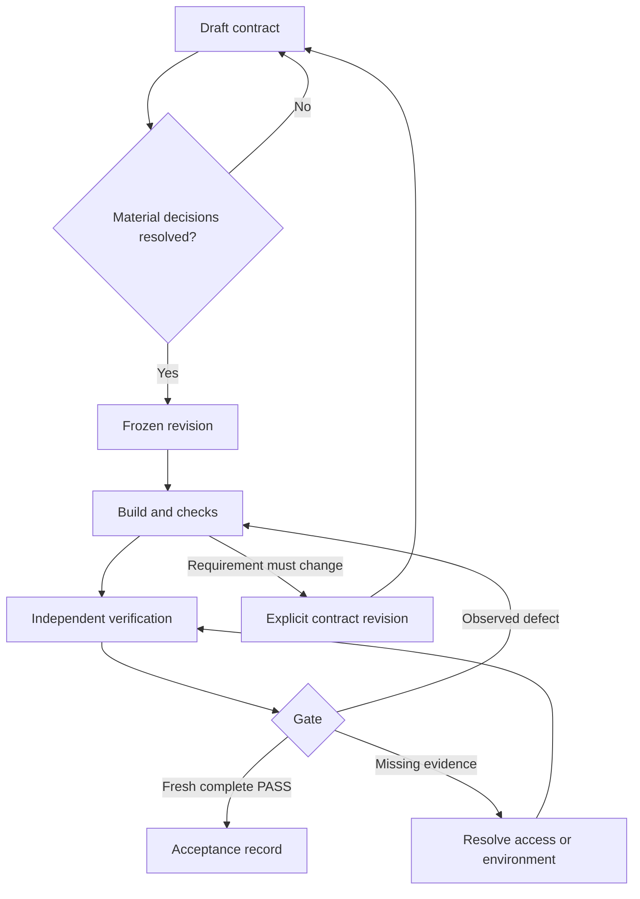

# Responsibility

The skill owns progress from a given story to a defensible acceptance result. The builder owns implementation and useful tests; the independent verifier owns observations and criterion judgments; the [gate](./gate.md) owns the mechanical decision over submitted evidence. The user or team's authorized process owns changes to product intent and any required human approval.

These are workflow phases, not additional mandatory values in the machine schema. An acceptance record remains bound to the candidate it describes; it is not a mutable badge of permanent correctness.

# Operate the loop

| Phase | Owner and action | Exit condition |
| --- | --- | --- |
| Contract | Clarify intended behavior, scope, and check design | No unresolved material decision; baseline frozen |
| Build | Implement and repair within scope | Candidate and check locations ready for verification |
| Verify | Inspect assertions, run checks, record observations | A graded result for every criterion, including gaps |
| Gate | Check consistency, identity, freshness, coverage, and artifacts | Complete PASS, or specific blocking results |
| Repair | Fix demonstrated defects without weakening requirements | New candidate handed back for independent verification |
| Revise | Update intended behavior with authority and preserve history | New frozen revision; old evidence no longer current |

Do not continue an unproductive loop indefinitely. After the same failure recurs without a new diagnosis, report its cause and the input required to proceed. Exhausted access or an unavailable reviewer is a blocked dependency, not a reason to delete the criterion.

# Retain and grow

Keep accepted contracts, verdict records, and the referenced evidence available through the project's retention mechanism. Large traces and videos may live in a durable CI artifact store; record their identity and retention limitation. The bundled local gate requires local evidence files, so download or stage the needed artifacts before evaluating it.

Keep concept paths stable after acceptance; moving them to a done folder is optional and requires updating indexes and links. Supersede a contract rather than overwriting historical acceptance. A later regression does not erase evidence that an earlier candidate passed, but it does mean the current candidate has not established that behavior.

Keep regression IDs with tests as they move. Retire obsolete requirements explicitly. Promote a lesson into [project policy](./project-policy.md) only when it generalizes beyond one story. Do not add every incident as a permanent global rule.

# Compose with nearby skills

| Skill | Boundary |
| --- | --- |
| `to-story` | Helps express the story; proof owns observable acceptance and evidence |
| `autopilot` | Chooses work under its own authorization; proof handles a selected task |
| `test-stinky` | Reviews test-suite quality when needed; not a mandatory ceremony for each contract |
| `okf` | Maintains knowledge structure and provenance; does not execute acceptance by itself |
| `trust-card` | Grades artifact provenance; a signature does not establish story behavior |

These are optional collaborations, not installation dependencies. The [contract](./acceptance-contract.md), [verification](./verification.md), and [OKF placement](./okf-profile.md) references make proof usable by itself.

# Citations

Derived from the supplied [conversation](./sources.md) and the local gate's actual responsibilities. Role boundaries and retention choices are authored workflow conventions.
