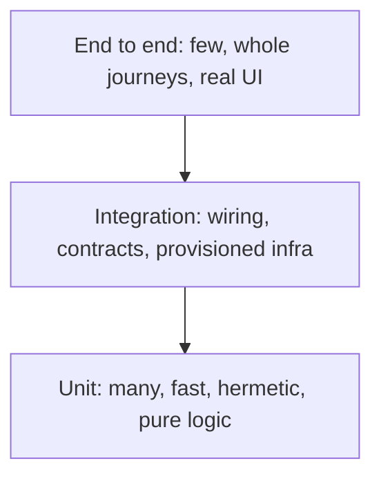

# Test Pyramid and Placement

The layer model behind every suite-shape argument. The named shapes disagree on ratios; they agree on the rule the [catalog](../catalog.md) actually enforces (category 35): **test each behavior at the cheapest layer that can catch its failure**, and accept a higher layer's cost only for what is new at that layer (the wiring, the journey).

## The named shapes

Pyramid
: Mike Cohn's original: many unit tests, fewer integration tests, very few end-to-end tests. The classic default for logic-heavy code. Its failure mode inverted is the ice-cream cone: everything tested through the UI, the shape the [suite pass](../suite-pass.md) hunts.

Trophy
: Kent C. Dodds's variant for wiring-dominated apps: the bulk sits at integration level because most frontend bugs live in the seams, not the pure functions. A trophy is a chosen shape, not an inverted pyramid; the catalog's guard says judge placement, not ratio.

Test sizes
: Google's orthogonal cut: small (one process, no I/O, milliseconds), medium (one machine, localhost allowed), large (anything goes). Size limits are enforced mechanically, which makes them the ancestor of the [hermetic lane split](hermeticity.md).

## Placement heuristics

- Pure logic with a reachable seam belongs in a unit test; an e2e that proves it is paying browser prices for arithmetic (catalog category 35).
- A behavior asserted at several layers has one earned home; the rest is accreted duplication unless it defends a business-critical invariant on purpose (category 37).
- Push-downs come paired with retirements: every unit test that takes over a proof should retire the expensive test above it, or the suite only grows.

# Citations

- Fowler, TestPyramid (https://martinfowler.com/bliki/TestPyramid.html)
- Vocke, The Practical Test Pyramid (https://martinfowler.com/articles/practical-test-pyramid.html)
- Kent C. Dodds, Write tests. Not too many. Mostly integration. (https://kentcdodds.com/blog/write-tests)
- Google Testing Blog, Test Sizes (https://testing.googleblog.com/2010/12/test-sizes.html)
