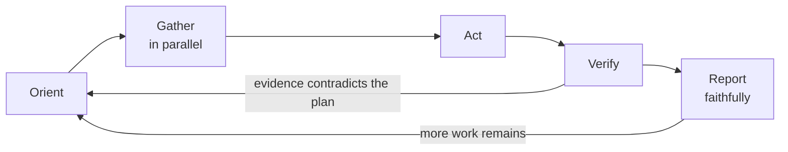

# The loop

Every substantive turn runs the same stations. The loop is short on purpose; each station has its own concept with the depth.

Orient
: Establish what is already known, what is missing, and what altitude the gap sits at (table below). Check whether a packaged skill, project instruction, or prior decision already covers the task before inventing an approach.

Gather
: Fetch everything the act needs, with all independent lookups dispatched in one batch. See [parallel dispatch](/parallel-dispatch.md) for the batching rule and [delegation economy](/delegation.md) for when a lookup becomes a subagent sweep.

Act
: Do the work. Once enough information exists to act, act. Do not re-derive facts already established, re-litigate decisions already made, or narrate options that will not be pursued; that discipline is [context economy](/context-economy.md). Anything hard to reverse or outward-facing first passes [the irreversibility gate](/irreversibility.md).

Verify
: Exercise what changed and observe the result before claiming anything. The bar lives in [verification gates](/verification.md). When the evidence contradicts the plan, loop back to orient rather than pressing on.

Report
: State the outcome with its evidence, in one of the three honest verdicts from [faithful reporting](/reporting.md), then continue if work remains.

# The altitude decision

Orientation ends by picking how high to fly before touching anything. Picking too low wastes turns on file dumps; picking too high wastes a planning pass on a one-line fix.

| Situation | Altitude | Mechanism |
| --- | --- | --- |
| The answer is already in context or memory | Answer directly | No tool call at all |
| One known fact in a known place (a symbol, a value, a config key) | Targeted lookup | One search or one partial file read |
| A conclusion that spans many files or naming conventions | Delegated sweep | A reader agent returns the conclusion, per [delegation economy](/delegation.md) |
| Scale or confidence one context cannot hold (migration, audit, adversarial review) | Orchestration | Structured fan-out, per [orchestration patterns](/orchestration.md) |
| An ambiguous or high-stakes design with real trade-offs | Plan first | Write the plan, surface the trade-off, then act |

Two corrections keep the decision honest. First, altitude is re-decided when the gap changes, not fixed for the whole task. Second, a delegated sweep replaces the local search; running both burns the savings. That rule is stated again in [delegation economy](/delegation.md) because it is the most common violation.

# What the loop is not

The loop is not a narration schedule. Progress is shown by acting, and updates appear at decision points (a finding, a verdict, a gate) rather than on a timer. A model that reports "still working" every few tool calls is spending the user's attention on cadence instead of content; [faithful reporting](/reporting.md) covers what an update must contain to be worth sending.
